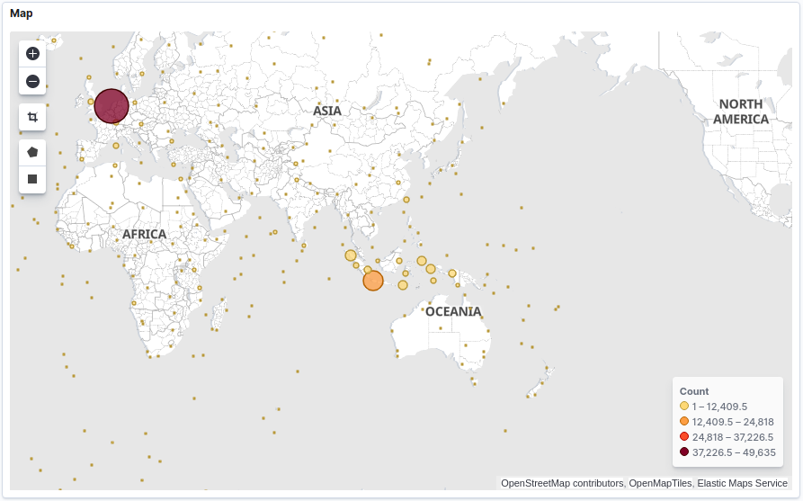
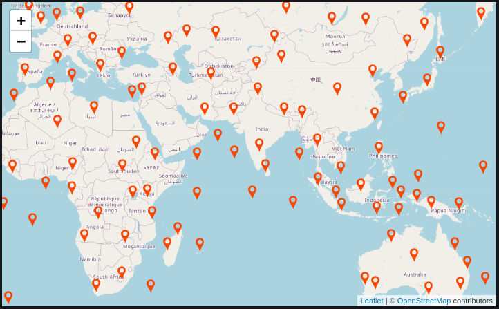

# Explore a GBIF dataset

## Description
Grafana dashboard with interactive map to explore a GBIF dataset. Debezium sync to Elasticsearch. Database size: 2821 MB. 

## How to use
Clone this repo:
```
git clone https://github.com/rudibroekhuizen/docker-compose-explore.git
```

Start the containers:
```
docker-compose up -d
```

Browse to http://localhost:3000/dashboards in your browser to use the Grafana dashboard.


When all containers are up start this script to start sync:
```
./sync_to_elasticsearch.sh
```


Import Kibana dashboard:
```
./load_kibana_dashboard.sh
```

Browse to http://localhost:5601 in your browser to use the Kibana dashboard.

## Load manually
```
git clone https://github.com/rudibroekhuizen/docker-compose-explore /tmp
cd docker-compose-explore/postgres/docker-entrypoint-initdb.d
chmod +x 20-setup.sh
./20-setup.sh
su postgres
psql -d db1 -f 30-setup.sql
psql -d db1 -f 40-normalize.sql
```

## Screenshots


